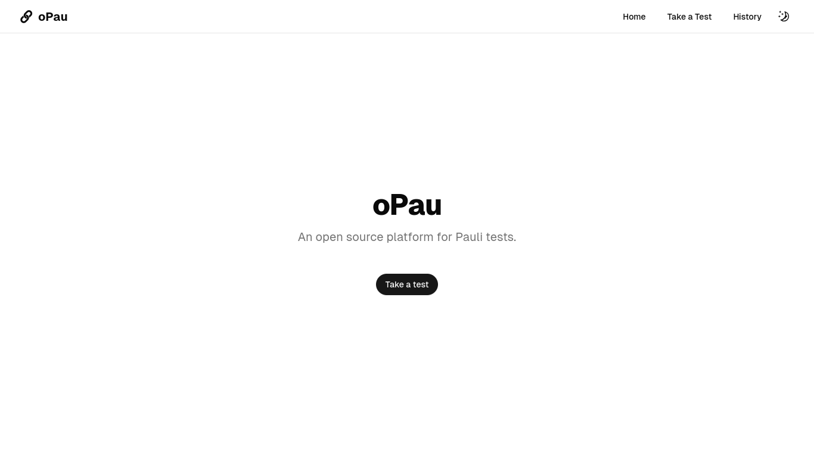
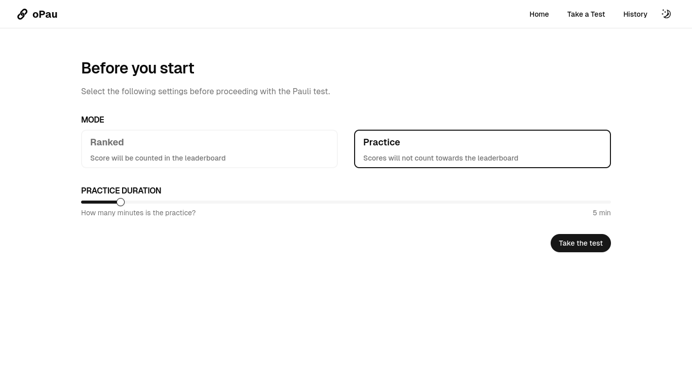
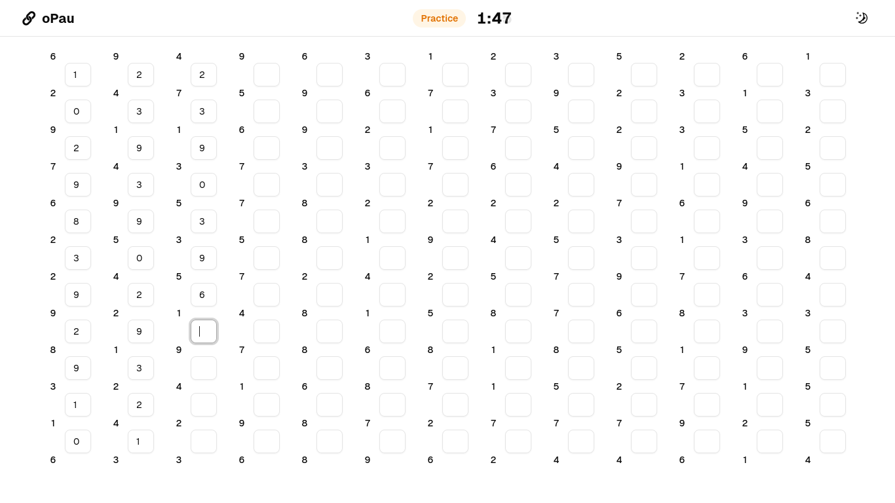
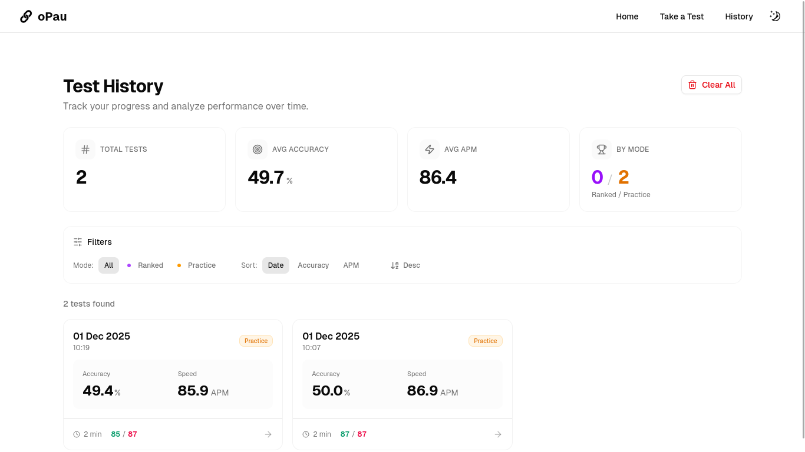

#  oPau

> **⚠️ heads up: this is still a prototype! expect bugs, missing features, and random jank.**

A simple web app for taking Pauli tests (you know, that psychology test where you add numbers until your brain hurts).

Basically it's a digital version of the Pauli test. You add pairs of numbers, work at your own pace, and the app tracks your speed, accuracy, and how much you're dying by the end ;).

## features:

- **practice mode** - just mess around, no pressure
- **ranked mode** - for when you actually wanna see how you perform
- **history tracking** - keeps all your test results locally (indexedDB)
- **dark mode** - because of course
- **detailed metrics** - speed (APM), accuracy, consistency, endurance/fatigue

## preview

### Home



### Pre-Test



### Test



### History



## tech stack

- Vue 3 + TypeScript
- Vite
- Tailwind CSS
- Pinia (state management)
- IndexedDB (local storage)
- Unovis (charts)

## setup

```bash
npm install
npm run dev
```

that's it. open `localhost:5173` and you're good to go

## other commands

```bash
npm run build      # production build
npm run type-check # check types
npm run lint       # fix eslint issues
```

## project structure

```
src/
├── components/     # vue components
├── composables/    # reusable vue logic
├── domain/         # pauli test business logic
├── infrastructure/ # database stuff
├── services/       # api layer
├── stores/         # pinia stores
├── types/          # typescript types
├── utils/          # helper functions
└── views/          # page components
```

## notes

- all data stays on your device (no backend)
- metrics are based on actual Pauli test scoring standards (check `PAULI_SCORING.md` if you're curious)
- still a prototype so some things might be janky

## license

MIT License - see [LICENSE](LICENSE) file for details
